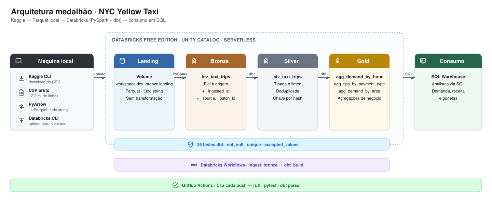

# ETL Project with Databricks and dbt

[](../../actions/workflows/ci.yml)


Pipeline ELT com arquitetura medalhão (**bronze → silver → gold**) sobre as corridas de táxi amarelo de Nova York, construído com PySpark e dbt no Databricks.

Projeto de portfólio — escrito do zero, de forma incremental, priorizando decisões defensáveis sobre escopo grande.

---

## Sumário

- [Arquitetura](#arquitetura)
- [Stack](#stack)
- [Dados](#dados)
- [Modelo de dados](#modelo-de-dados)
- [Decisões de projeto](#decisões-de-projeto)
- [Qualidade e CI](#qualidade-e-ci)
- [Como rodar](#como-rodar)
- [Estrutura do repositório](#estrutura-do-repositório)
- [Próximos passos](#próximos-passos)
- [Autor](#autor)

---

## Arquitetura

<p align="center">
  
</p>

O dado nasce como CSV baixado do Kaggle, é convertido para Parquet localmente e sobe para um volume do Unity Catalog. A partir daí, tudo roda dentro do Databricks: PySpark materializa a camada bronze e o dbt assume a modelagem de silver e gold.

| Camada | Tabela | Motor | O que faz |
| --- | --- | --- | --- |
| Landing | Volume `landing` | Databricks CLI | Parquet local enviado ao workspace, todas as colunas em `string` |
| Bronze | `brz_taxi_trips` | PySpark | Dado fiel à origem, sem regra de negócio, mais `_ingested_at`, `_source` e `_batch_id` |
| Silver | `slv_taxi_trips` | dbt | Tipada, deduplicada, com chave substituta por hash (a origem não tem chave natural) |
| Gold | `agg_demand_by_hour` | dbt | Demanda e receita por data, dia da semana e hora |
| Gold | `agg_tips_by_payment_type` | dbt | Gorjeta média e total por tipo de pagamento |
| Gold | `agg_demand_by_area` | dbt | Demanda e receita por célula de coordenada (grade de ~1,1 km) |

Orquestração via **Databricks Workflows** (`ingest_bronze` → `dbt_build`) e CI via **GitHub Actions** a cada push.

## Stack

| Camada | Ferramenta |
| --- | --- |
| Plataforma | Databricks Free Edition · Unity Catalog · SQL Warehouse serverless |
| Ingestão | PySpark |
| Transformação | dbt (`dbt-databricks`) |
| Armazenamento | Delta Lake (storage gerenciado) |
| Ambiente local | Python 3.12 · uv |
| Qualidade | pytest · ruff |
| CI/CD | GitHub Actions |

## Dados

- **Fonte:** [Kaggle · `elemento/nyc-yellow-taxi-trip-data`](https://www.kaggle.com/datasets/elemento/nyc-yellow-taxi-trip-data)
- **Arquivo usado:** `yellow_tripdata_2016-03.csv` — 12.210.952 linhas, 19 colunas
- **Tipo de carga:** carga única (full load), sem CDC

## Modelo de dados

**Silver** (`slv_taxi_trips`) — grão: uma linha por corrida, com `trip_id` (hash das colunas de origem) como chave substituta, colunas tipadas (`timestamp`, `double`, `int`) e duplicatas exatas removidas.

**Gold** — três marts de agregação, todos derivados da silver:

```text
slv_taxi_trips
    ├─▶ agg_demand_by_hour          (data · dia da semana · hora)
    ├─▶ agg_tips_by_payment_type    (tipo de pagamento)
    └─▶ agg_demand_by_area          (célula de coordenada, ~1,1 km)
```

## Decisões de projeto

| Decisão | Motivo |
| --- | --- |
| PySpark na bronze, dbt em silver e gold | Cada ferramenta faz o que faz melhor: PySpark cuida da leitura e dos metadados de ingestão; dbt cuida de modelagem, testes e documentação |
| Bronze toda em `string` | Preserva a fidelidade à origem — a tipagem, que pode falhar ou exigir regra, acontece só na silver |
| Free Edition, sem storage externo | Custo zero para um projeto de portfólio. A Free Edition não suporta storage customizado, então o Delta fica no storage gerenciado da plataforma |
| Chave por hash na silver | O dataset de origem não tem chave natural nem primária |
| Grade de coordenadas na gold | O dataset não tem `LocationID`. Coordenadas `(0, 0)` — erro de GPS — são excluídas apenas do modelo de área, sem afetar os demais |
| Um único workspace, schemas `dev_*` | Evita o custo de ambientes separados para um projeto individual. Schemas `prod_*` ficam para uma evolução futura |
| Workflow criado pela UI, não por código | Escopo enxuto por decisão consciente. Databricks Asset Bundles é a evolução natural quando o time crescer |

## Qualidade e CI

- **26 testes dbt** (`not_null`, `unique`, `accepted_values`) cobrindo as camadas silver e gold
- **3 testes pytest** para a conversão CSV → Parquet
- **CI a cada push**, via GitHub Actions: `ruff check`, `pytest`, `dbt parse`
  - O `dbt build` não roda no CI para não consumir a quota de warehouse da Free Edition — trade-off deliberado entre cobertura de CI e custo

## Como rodar

### Pré-requisitos

- [uv](https://docs.astral.sh/uv/)
- [Databricks CLI](https://docs.databricks.com/aws/en/dev-tools/cli/)
- Um workspace Databricks Free Edition
- Credenciais de API do [Kaggle](https://www.kaggle.com/docs/api)

### 1. Instalar dependências

```bash
uv sync
```

### 2. Configurar credenciais

Copie `.env.example` para `.env` e preencha as credenciais do Kaggle e do Databricks. O `.env` nunca é versionado.

```bash
cp .env.example .env
```

### 3. Baixar o CSV e converter para Parquet

```bash
uv run --env-file .env kaggle datasets download elemento/nyc-yellow-taxi-trip-data \
  -f yellow_tripdata_2016-03.csv -p data/raw
unzip data/raw/yellow_tripdata_2016-03.csv.zip -d data/raw

uv run python src/taxi_pipeline/csv_to_parquet.py \
  data/raw/yellow_tripdata_2016-03.csv data/landing/yellow_tripdata_2016-03.parquet
```

### 4. Subir o Parquet para o Databricks

Crie os schemas `dev_bronze`, `dev_silver` e `dev_gold`, mais o volume `workspace.dev_bronze.landing`. Depois:

```bash
databricks fs cp data/landing/yellow_tripdata_2016-03.parquet \
  dbfs:/Volumes/workspace/dev_bronze/landing/yellow_tripdata_2016-03.parquet
```

### 5. Rodar a ingestão bronze

Execute o notebook `src/taxi_pipeline/ingest_bronze.py` no Databricks (via Git folder ligado a este repositório).

### 6. Rodar o dbt

Configure o profile `taxi_pipeline` em `~/.dbt/profiles.yml` lendo as variáveis do `.env`, depois:

```bash
cd dbt/taxi_pipeline
uv run --env-file ../../.env dbt build
```

> Para rodar tudo de uma vez, o job `taxi_pipeline_dev` do Databricks Workflows encadeia `ingest_bronze` → `dbt_build`.

## Estrutura do repositório

```text
.
├── src/taxi_pipeline/       # scripts Python — conversão CSV → Parquet, ingestão bronze
├── dbt/taxi_pipeline/       # projeto dbt — models de silver e gold, testes, docs
├── tests/                   # testes pytest
├── docs/images/             # diagramas e imagens usados neste README
└── .github/workflows/       # pipeline de CI
```

## Próximos passos

- [ ] Databricks Asset Bundles para versionar o job como código
- [ ] Schemas `prod_*` e configuração dinâmica por ambiente
- [ ] Enriquecimento geográfico com zonas oficiais de Nova York (substituindo a grade de coordenadas)
- [ ] Carga dos demais arquivos do dataset (o pipeline já é parametrizado por arquivo)

## Autor

**William Sebastião**
[LinkedIn](https://www.linkedin.com/in/william-sebastiao/)
